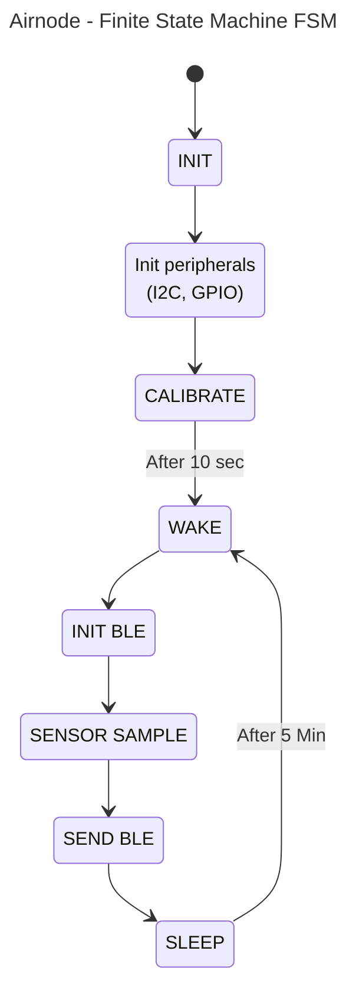

```mermaid
---
title: Airnode - Finite State Machine FSM

---

stateDiagram
direction TB
[*] --> Init
Init --> InitPeripherals
InitPeripherals --> WarmUp
WarmUp --> Wake:After 10 sec
Wake --> InitBLE
InitBLE --> SensorSample
SensorSample --> SendBLE
SendBLE --> Sleep
Sleep --> Wake:After 5 Min

Init:INIT
InitPeripherals:Init peripherals <br>(I2C, GPIO)
Sleep:SLEEP
Wake:WAKE
InitBLE: INIT BLE
SensorSample: SENSOR SAMPLE
SendBLE: SEND BLE
WarmUp: CALIBRATE
```
